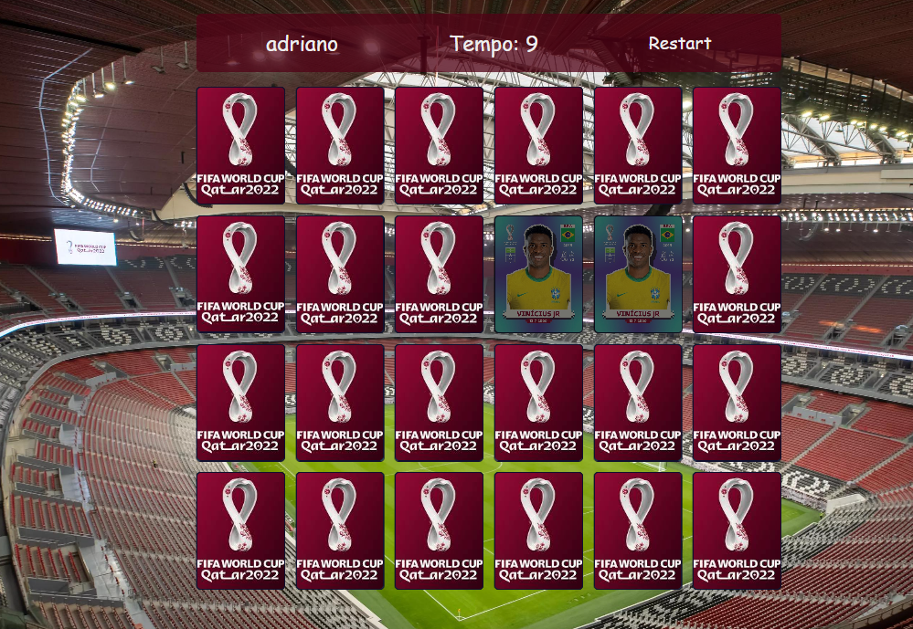

# Jogo da memoria

#### Teste sua memória com esse jogo de encontrar os pares das figurinhas da copa!

> Pequena demonstração em gif da aplicação!
> 

 

Nessa aplicaçao voce pode testar o seu cérebro em um simples jogo. Aplicação foi feita com JavaScript, css e html. Foi usado o local storage para guardar e recuperar o nome do jogador.

  

Link da aplicação: https://adrianosantos-memorygame.netlify.app/
